## Cytometry Cluster Annotation and Differential Abundance Suite

#### Efficient and reproducible cytometry data

[](https://doi.org/10.1093/bioinformatics/btae595)

Aims:

• facilitating the process of cluster annotation while reducing user bias • improving reproducibility

Key features:

• defining the threshold of positive/negative marker expression

• interactive inspection of cluster phenotypes

• automatic merging of populations

• differential abundance analysis

## Installation Instructions

``` r
library(devtools)

# Install all required packages
devtools::install_github("DII-LIH-Luxembourg/cycadas", dependencies = TRUE)

library(cycadas)
# start the cycadas shiny app
cycadas()
```

### Demo dataset

To enable tool exploration, we provide the demo dataset that can be loaded (**Load** tab → **Demo Data**) either as cluster expression data only (**Load Cluster Expression Demo Data**, allowing the user to create the annotation) or as annotated data (**Load Annotated Demo Data** which include the annotation tree).

*This demo dataset is generated from the publicly available mass cytometry data of patients with idiopathic Parkinson's disease and healthy controls (Capelle, C.M. et al., Nat Commun, 2023) that were clustered with GigaSOM to generate 1600 clusters.*

### Loading SingleCellExperiment Data (CATALYST)

This is optional. If you wish to load data clustered with CATALYST or other Tools using the Single Cell Format, please install:

``` r
if (!require("BiocManager", quietly = TRUE))
    install.packages("BiocManager")

BiocManager::install("CATALYST")
BiocManager::install("SingleCellExperiment")
```

### Data input, Single Cell Format

```{r}

# CATALYST Workflow using Single Cell Experiment data object
# Preprocessing ...

# Cluster with CATALYST
sce <- cluster(sce, features = "type", 
               xdim = 10, ydim = 10, maxK = 20, 
               verbose = FALSE, seed = 1)   

# Save the object as .rds file
saveRDS(sce, "my_sce.rds")

# Load into CyCadas
# Annotate the desired (meta-)cluster levels
# use the integrated merge function within Cycadas
# save the object 
# load it back into your workflow
sce <- readRDS("Annotated_sce.rds")

# continue downstream analysis
# ...
```

### Data Input from FlowSOM

#### Median Expression and Cluster Frequencies:

``` r
# within your clustering workflow create sample_ids according to the metadata files:

sample_ids <- rep(metadata$sample_id, fsApply(fcs, nrow))

library(FlowSOM)
fsom <- ReadInput(fcs, transform = FALSE, scale = FALSE)

set.seed(42)
som <- BuildSOM(fsom, colsToUse = lineage_markers, xdim=20, ydim=20, rlen=40)

expr_median <- som$map$medianValues

# Calculate cluster frequencies
clustering_table <- as.numeric(table(som$map$mapping[,1]))
clustering_prop <- round(clustering_table / sum(clustering_table) * 100, 2)
df_prop <- as.data.frame(clustering_prop)
df_prop$cluster <- rownames(df_prop)

write.csv(expr_median, "expr_median.csv", row.names = F)
write.csv(df_prop, "cluster_freq.csv")

## ----------------------------------------------------------------------------
## Generate the Proportion Table
## ----------------------------------------------------------------------------
counts_table <- table(som$map$mapping[,1], sample_ids)
props_table <- t(t(counts_table) / colSums(counts_table)) * 100

props <- as.data.frame.matrix(props_table)

write.csv(props, "proportion_table.csv")
```

### Data Input from GigaSOM

#### Median Expression and Cluster Frequencies:

``` julia
gridSize = 20
nEpochs = 40

som = initGigaSOM(di, gridSize, gridSize, seed = 42) # set a seed value
som = trainGigaSOM(som, di, epochs = nEpochs)

mapping_di = mapToGigaSOM(som, di)
mapping = gather_array(mapping_di)

num_cluster = gridSize^2
# get the cluster frequencies
clusterFreq = dcount(num_cluster, mapping_di)
df = DataFrame(cluster = 1:length(df), clustering_prop = clusterFreq)
df.clustering_prop = df.clustering_prop ./ sum(df.clustering_prop)
CSV.write("cluster_freq.csv", df)

files = distributeFCSFileVector(:fileIDs, md[:, :file_name])

# Get the count table per fileID
count_tbl = dcount_buckets(num_cluster, mapping_di, size(md, 1), files)
ct = DataFrame(count_tbl, :auto)
# ct = convert(DataFrame, count_tbl)
rename!(ct, md.sample_id)
# export the count talbe
CSV.write("cluster_counts.csv", ct)

# Get the median expression per cluster
expr_tbl = dmedian_buckets(di, num_cluster, mapping_di, cols)

et  = DataFrame(expr_tbl, :auto)
rename!(et, lineage_markers)

# export median marker expression
CSV.write("median_expr.csv", et)
```

Detailed workflow for each method can be found in the data section.

### Data exploration

The **UMAP interactive** tab allows the preview of marker expression in the clusters selected by the user on the UMAP:

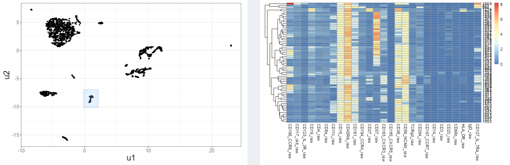

In the **UMAP Marker expression** tab, user can investigate the expression level of the selected marker across all the clusters.

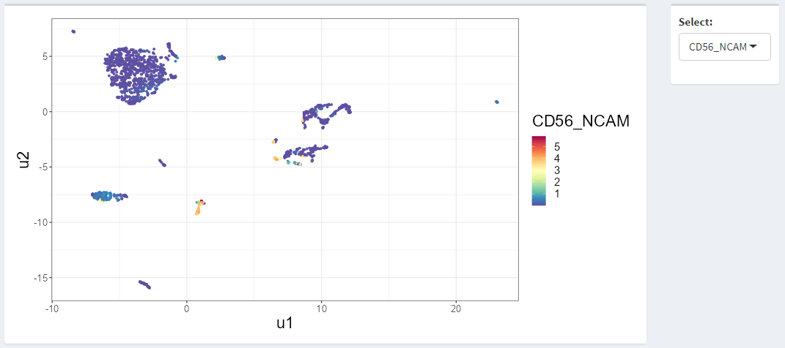

### Thresholds

In the **Thresholds** tab, the estimation of threshold value defining negative and positive marker expression of each marker is based on 1-dimensional k-means clustering and Mclust. A silhouette score chooses the best estimation of each marker. The bimodality for every marker is assessed and the bimodal coefficient values are reported. The blue threshold line indicates that data meets the bimodal distribution criteria, otherwise it is colored red. The threshold value can be manually adjusted by clicking on the scatterplot.

*Expression of CD8a with blue threshold line indicating the bimodal distribution:*

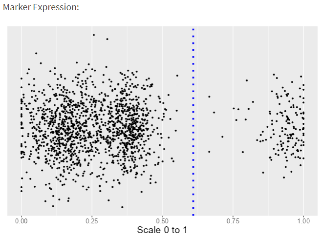

*Expression of TCRgd with red threshold line indicating that this marker expression does not follow the bimodal distribution:*

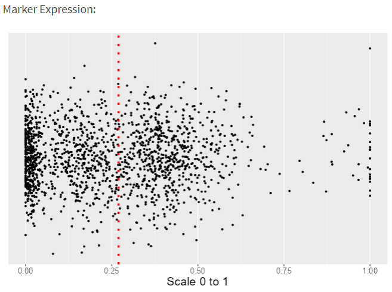

### Annotation

The **Annotation** tab allows performing the annotation in a tree-based hierarchical process - initially, the main cell types are defined, followed by the identification of their subtypes (with the level of detail defined by the user).

All the clusters are initially defined as "unassigned". Then, upon the selection of positive and negative markers defining the population, clusters characterized by given expression pattern are re-assigned from the parent node to the child node.

*Scheme depicting the process of building the annotation tree:*

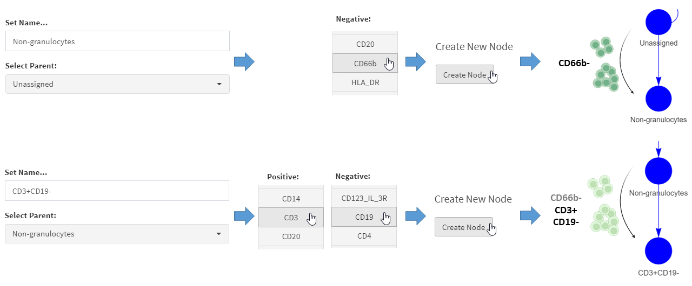

*Cropped fragment of the completed annotation tree:*

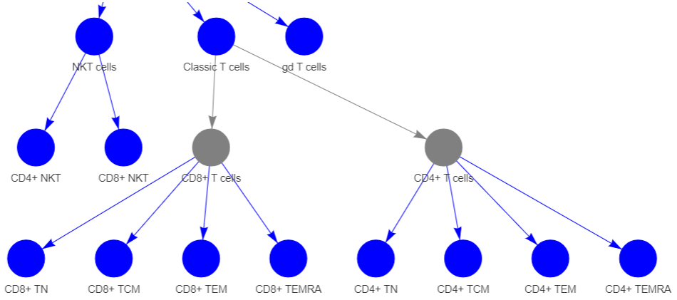

Upon selection of the node, heatmap displaying the expression of all the markers in all the clusters belonging to this node is shown.

*Heatmap depicting phenotype of clusters annotated as CD8+ TEM cells:*

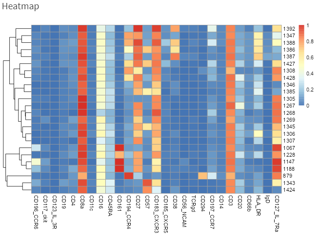

### Differential abundance analysis

In the **Differential Abundance** tab, a pairwise Wilcoxon test on all the nodes is performed upon selecting the desired multiple testing correction method:

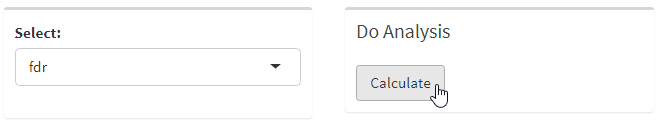

**DA Interactive Tree** allows exploration of abundance of all the defined subpopulations across the conditions by selecting the node on the annotation tree.

*Upon clicking on the desired node...*

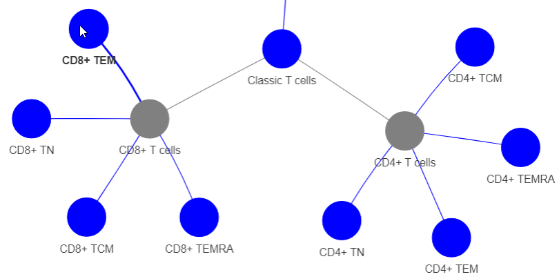

*... proportion of the selected celltype across the condition is plotted.*

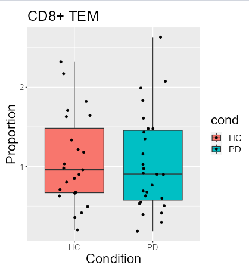

### Data export

Differential abundance analysis results, as well as proportion table (% of defined cell populations across all the samples) can be exported in the **Differential Abundance** tab.

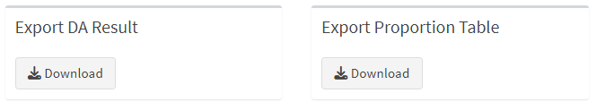

Files enabling the continuation of the analysis - modified threshold values, as well as annotation tree structure, can be exported from the **Thresholds** and **Annotation** tabs, respectively, and re-loaded (**Load** tab) to continue the analysis.

*Exporting annotation tree:*

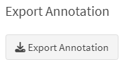

*Exporting threshold values:*

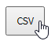
